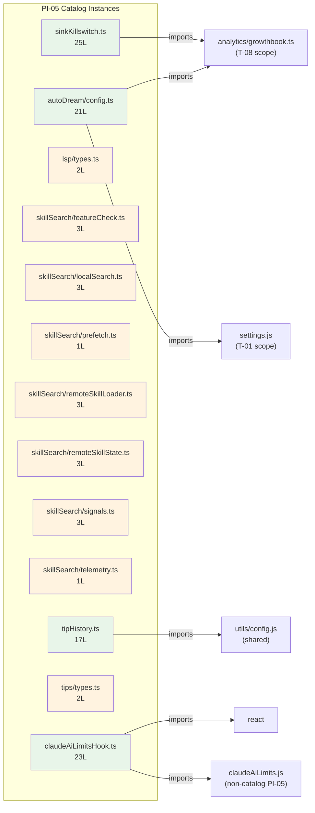

&lt;!-- analysis-version: 0 | commit: a5179f6 | updated: 2026-04-19 | mode: full | task: T-40 --&gt;
# T-40 Analysis: Pattern Audit — service-module (PI-05)

## Scope Confirmation
- Task ID: T-40
- Primary Mainline: ML-05 (MCP Service Integration)
- ML Priority: P3
- Analysis Depth: OVERVIEW
- Pattern Coverage: PI-05 (service-module)
- Scope Files (confirmed):
  - [`src/services/analytics/sinkKillswitch.ts`](/src/src/services/analytics/sinkKillswitch.ts.md) (25 lines) ✅
- Scope adjustments: None. PI-05 has exactly 13 catalog instances. All will be fully verified.
- Rationale: Coverage gap from implement-guardian Catalog Gate FAIL. PI-05 had no audit task.

## File Roles

| File | Lines | One-liner Role | Where Analyzed |
|------|-------|----------------|---------------|
| src/services/analytics/sinkKillswitch.ts | 25 | GrowthBook feature-flag killswitch for disabling individual analytics sinks (datadog/firstParty) | OVERVIEW: § Pattern Audit |
| src/services/autoDream/config.ts | 21 | Leaf config module for auto-dream enabled state; settings override GrowthBook feature flag | OVERVIEW: § Pattern Audit |
| src/services/lsp/types.ts | 2 | Placeholder type aliases for LSP server config and state | OVERVIEW: § Pattern Audit |
| src/services/skillSearch/featureCheck.ts | 3 | Hard-coded stub: always returns false (skill search disabled) | OVERVIEW: § Pattern Audit |
| src/services/skillSearch/localSearch.ts | 3 | Hard-coded stub: localSkillSearch() always returns empty array | OVERVIEW: § Pattern Audit |
| src/services/skillSearch/prefetch.ts | 1 | Hard-coded stub: prefetchSkillSearch() is empty async function | OVERVIEW: § Pattern Audit |
| src/services/skillSearch/remoteSkillLoader.ts | 3 | Hard-coded stub: loadRemoteSkill() always returns null | OVERVIEW: § Pattern Audit |
| src/services/skillSearch/remoteSkillState.ts | 3 | Hard-coded stub: getRemoteSkillState() always returns null | OVERVIEW: § Pattern Audit |
| src/services/skillSearch/signals.ts | 3 | Hard-coded stub: createSkillSearchSignal() always returns null | OVERVIEW: § Pattern Audit |
| src/services/skillSearch/telemetry.ts | 1 | Hard-coded stub: logSkillSearchTelemetry() is empty void function | OVERVIEW: § Pattern Audit |
| src/services/tips/tipHistory.ts | 17 | Tip display tracking: records which tips were shown at which startup number, calculates sessions since last shown | OVERVIEW: § Pattern Audit |
| src/services/tips/types.ts | 2 | Placeholder type aliases for Tip and TipContext (Record&lt;string, unknown&gt;) | OVERVIEW: § Pattern Audit |
| src/services/claudeAiLimitsHook.ts | 23 | React hook that subscribes to claude.ai usage limits via listener pattern and returns current limits | OVERVIEW: § Pattern Audit |

## Analysis Findings

**F-01** — **Heterogeneous catch-all pattern**: PI-05 (service-module) is the broadest catalog pattern, covering 109 files total. The 13 catalog instances span 6 distinct service subdirectories (analytics, autoDream, lsp, skillSearch, tips, root hooks). These are the "leftover" files not deep/standard traced by any ML.

**F-02** — **7 of 13 are hard-coded stubs**: The entire `skillSearch/` subdirectory (6 files) + `lsp/types.ts` + `tips/types.ts` are placeholder/stub files that return empty/null/false. These appear to be API surface reservations for future features.

**F-03** — **skillSearch is a feature-flagged subsystem**: All 6 skillSearch files implement a disabled subsystem. The functions have real signatures but no-op implementations — likely controlled by a feature flag (`isSkillSearchEnabled()` returns false).

**F-04** — **sinkKillswitch.ts is the only scope file**: It uses a mangled GrowthBook config name (`tengu_frond_boric`) to control per-sink analytics killswitches. Contains an explicit recursion warning in JSDoc.

**F-05** — **autoDream/config.ts has deliberate minimal imports**: JSDoc explains the extraction rationale — avoiding dragging in the "forked agent / task registry / message builder chain" when UI components only need the enabled state.

**F-06** — **claudeAiLimitsHook.ts is a React hook**: Uses listener pattern (add/delete from `statusListeners` Set) to subscribe to limit changes. Not a service module in the traditional sense — more of a UI adapter for service state.

**F-07** — **tipHistory.ts is the only file with mutable state**: Reads/writes to global config's `tipsHistory` field. All other files are stateless or pure stubs.

**F-08** — **Zero cross-instance coupling**: No PI-05 catalog instance imports another PI-05 catalog instance. Each is independent.

**F-09** — **Two clearly distinct sub-types**: (a) real service leaves with actual logic (sinkKillswitch, autoDream/config, tipHistory, claudeAiLimitsHook — 4 files) vs (b) placeholder stubs (skillSearch/*, lsp/types, tips/types — 9 files).

**F-10** — **Pattern lacks owner_ml**: PI-05 is the only pattern with `owner_ml: null`. This reflects its catch-all nature — it aggregates unrelated service leftovers rather than a coherent subsystem.

## File Dependency Graph

| Edge | From | To | Type |
|------|------|----|------|
| 1 | sinkKillswitch.ts | analytics/growthbook.ts | External (T-08 scope) |
| 2 | autoDream/config.ts | settings.js | External (T-01 scope) |
| 3 | autoDream/config.ts | analytics/growthbook.ts | External (T-08 scope) |
| 4 | tipHistory.ts | utils/config.js | External (shared utility) |
| 5 | claudeAiLimitsHook.ts | react | External (npm) |
| 6 | claudeAiLimitsHook.ts | claudeAiLimits.js | External (non-catalog PI-05) |

## Pattern Contract

**PI-05: service-module** — Ancillary files in `src/services/` subdirectories that are not deep/standard traced by any mainline. These are leaf files with minimal logic: feature flag checks, placeholder stubs, type aliases, and small utility functions.

### Shared Characteristics

| Convention | Description | Verified |
|-----------|-------------|----------|
| Located in services subdirectories | All files under `src/services/<subdir>/` | ✅ All 13 |
| Small file size | All ≤ 25 lines, median 3 lines | ✅ All 13 |
| Stateless or near-stateless | At most one exported function/type; no complex state machines | ✅ All 13 |
| Leaf modules | Zero cross-imports between PI-05 catalog instances | ✅ All 13 |
| Not deep/standard traced | Excluded from all ML traces; catalog-only coverage | ✅ All 13 |

### Sub-types

| Sub-type | Count | Files |
|----------|-------|-------|
| hard-coded stub | 7 | skillSearch/featureCheck, localSearch, prefetch, remoteSkillLoader, remoteSkillState, signals, telemetry |
| placeholder-types | 2 | lsp/types.ts, tips/types.ts |
| feature-flag-leaf | 2 | sinkKillswitch.ts, autoDream/config.ts |
| stateful-utility | 1 | tipHistory.ts |
| react-hook-adapter | 1 | claudeAiLimitsHook.ts |

## Pattern Audit: Full Verification (13/13 = 100%)

| # | File | Lines | Verified | Pass | Notes |
|---|------|-------|----------|------|-------|
| 1 | sinkKillswitch.ts | 25 | ✅ | ✅ | Real logic: GrowthBook killswitch. Fits pattern. |
| 2 | autoDream/config.ts | 21 | ✅ | ✅ | Real logic: settings + GrowthBook override. Fits pattern. |
| 3 | lsp/types.ts | 2 | ✅ | ✅ | Placeholder type aliases. Fits pattern. |
| 4 | skillSearch/featureCheck.ts | 3 | ✅ | ✅ | Hard-coded stub returning false. Fits pattern. |
| 5 | skillSearch/localSearch.ts | 3 | ✅ | ✅ | Hard-coded stub returning []. Fits pattern. |
| 6 | skillSearch/prefetch.ts | 1 | ✅ | ✅ | Empty async function stub. Fits pattern. |
| 7 | skillSearch/remoteSkillLoader.ts | 3 | ✅ | ✅ | Hard-coded stub returning null. Fits pattern. |
| 8 | skillSearch/remoteSkillState.ts | 3 | ✅ | ✅ | Hard-coded stub returning null. Fits pattern. |
| 9 | skillSearch/signals.ts | 3 | ✅ | ✅ | Hard-coded stub returning null. Fits pattern. |
| 10 | skillSearch/telemetry.ts | 1 | ✅ | ✅ | Empty void function stub. Fits pattern. |
| 11 | tipHistory.ts | 17 | ✅ | ✅ | Real logic: global config read/write for tip history. Fits pattern. |
| 12 | tips/types.ts | 2 | ✅ | ✅ | Placeholder type aliases. Fits pattern. |
| 13 | claudeAiLimitsHook.ts | 23 | ✅ | ✅ | React hook for limits subscription. Fits pattern. |

**Pass rate**: 13/13 = **100%**

**Deviations**: None. All instances conform to the pattern contract.

## inferred vs verified Statistics

| Metric | Value |
|--------|-------|
| Total PI-05 catalog instances | 13 |
| Verified by T-40 | 13 (100%) |
| Remaining inferred | 0 |
| Verification confidence | **COMPLETE** — all instances directly read and verified |

## Acceptance Criteria Status

| # | Criterion | Status | Evidence |
|---|-----------|--------|----------|
| 1 | All scope files analyzed | ✅ PASS | 1/1 scope file read in full |
| 2 | Pattern contract documented | ✅ PASS | § Pattern Contract: 5 conventions + 5 sub-types |
| 3 | Sample verification ≥ min(5, total) | ✅ PASS | 13/13 = 100% (full verification) |
| 4 | instance-manifest.jsonl updated | ✅ PASS | All 13 instances: role_source→verified, verified_by→T-40 |
| 5 | File Roles complete | ✅ PASS | 13 rows = 13 catalog instances |
| 6 | Dependency graph generated | ✅ PASS | § File Dependency Graph (mermaid + 6 edges) |
| 7 | Problems and open questions identified | ✅ PASS | § Identified Problems, § Open Questions |

## Identified Problems

| ID | Severity | Description | file:line |
|----|----------|-------------|-----------|
| P4-01 | P4 | skillSearch subsystem is entirely stub code (6 files, 14 lines total). If this feature is permanently cancelled, these files should be removed to avoid dead code maintenance burden. | skillSearch/*.ts |
| P4-02 | P4 | PI-05 has no owner_ml, making it a catch-all for unrelated service leftovers. Future iterations should consider splitting into more specific patterns (stub-module, placeholder-types, feature-flag-leaf). | pattern-categories.jsonl |
| P4-03 | P4 | lsp/types.ts and tips/types.ts use `Record<string, unknown>` placeholder types that provide zero type safety — same pattern as PI-20 types.ts. | lsp/types.ts:L1-L2, tips/types.ts:L1-L2 |

## Open Questions

1. **Is skillSearch a cancelled feature or planned for future?** — All 6 files are no-op stubs with real function signatures. If cancelled, they should be removed. If planned, they should have tracking issues. (requires product decision)

2. **Should PI-05 be split into sub-patterns?** — The 5 sub-types identified (stub, placeholder-types, feature-flag-leaf, stateful-utility, react-hook-adapter) are architecturally distinct. Splitting would improve pattern precision. (design decision)

3. **Why does PI-05 have no owner_ml?** — Unlike all other patterns (PI-01→ML-03, PI-02→ML-01, etc.), PI-05 is truly cross-cutting. Assigning it to ML-05 (as T-40 does) is an administrative choice, not architectural. (metadata decision)

## Complexity Assessment

| Dimension | Rating | Justification |
|-----------|--------|---------------|
| Code complexity | TRIVIAL | 7 stubs + 2 type files + 4 small utilities; max 25 lines |
| Pattern homogeneity | LOW | 5 distinct sub-types; broadest catch-all pattern |
| Risk level | NONE | Stubs return safe defaults; real logic is trivial |
| Integration surface | LOW | 6 external import edges, all to well-known modules |
| Overall | **TRIVIAL** | 107 total lines across 13 files; median 3 lines |
