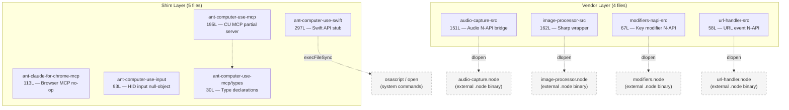

<!-- analysis-version: 0 | commit: a5179f6 | updated: 2025-07-14 | mode: full | task: T-41 -->
# T-41 Analysis: Shim & Vendor Proxy Layers

## Scope Confirmation
- Task ID: T-41
- Primary Mainline: ML-01 (CLI Startup & Command Routing)
- ML Priority: P3
- Analysis Depth: OVERVIEW
- Scope: Shim 代理层、Vendor 适配器、原生模块桥接
- Boundaries: 不涉及业务逻辑，纯粹是代理/重导出层
- Scope Files (confirmed, 9 files, 1,166 lines total):

| # | File | Lines | Exists |
|---|------|-------|--------|
| 1 | shims/ant-claude-for-chrome-mcp/index.ts | 113 | ✅ |
| 2 | shims/ant-computer-use-input/index.ts | 93 | ✅ |
| 3 | shims/ant-computer-use-mcp/index.ts | 195 | ✅ |
| 4 | shims/ant-computer-use-mcp/types.ts | 30 | ✅ |
| 5 | shims/ant-computer-use-swift/index.ts | 297 | ✅ |
| 6 | vendor/audio-capture-src/index.ts | 151 | ✅ |
| 7 | vendor/image-processor-src/index.ts | 162 | ✅ |
| 8 | vendor/modifiers-napi-src/index.ts | 67 | ✅ |
| 9 | vendor/url-handler-src/index.ts | 58 | ✅ |

- Scope adjustments: None. All files present and readable.
- Dependencies: none

## File Roles （强制节）

| File | Lines | One-liner Role | Where Analyzed |
|------|-------|----------------|---------------|
| shims/ant-claude-for-chrome-mcp/index.ts | 113 | No-op MCP server shim for Claude-in-Chrome browser extension: declares 17 browser tool schemas but logs warning on connect(), all handlers are fire-and-forget | OVERVIEW: § Analysis Findings |
| shims/ant-computer-use-input/index.ts | 93 | Null-object shim for macOS computer-use HID input (mouse/keyboard): exports typed no-op implementations with only cursor position tracking | OVERVIEW: § Analysis Findings |
| shims/ant-computer-use-mcp/index.ts | 195 | Compatibility shim for Computer Use MCP server: declares 22 tool definitions, provides partial request_access/list_granted_applications handler, all other tools return error | OVERVIEW: § Analysis Findings |
| shims/ant-computer-use-mcp/types.ts | 30 | Shared type declarations for Computer Use MCP: permission request/response, coordinate modes, host adapter, logger interfaces | OVERVIEW: § Analysis Findings |
| shims/ant-computer-use-swift/index.ts | 297 | Stub implementation of ComputerUseAPI for non-Swift environments: returns blank JPEG screenshots, uses osascript to list running apps, no native HID access | OVERVIEW: § Analysis Findings |
| vendor/audio-capture-src/index.ts | 151 | Lazy-loading native audio capture N-API bridge: 3-tier module resolution (native-embed env var → npm-install → dev source), exports recording/playback/mic-permission wrappers | OVERVIEW: § Analysis Findings |
| vendor/image-processor-src/index.ts | 162 | Sharp-compatible image processing wrapper over native .node module: lazy dlopen, deferred operation chaining (resize/jpeg/png/webp → toBuffer), plus optional clipboard image read | OVERVIEW: § Analysis Findings |
| vendor/modifiers-napi-src/index.ts | 67 | Lazy-loading macOS keyboard modifier key detector N-API bridge: exports getModifiers(), isModifierPressed(), prewarm() with env-var/dev-mode dual resolution | OVERVIEW: § Analysis Findings |
| vendor/url-handler-src/index.ts | 58 | Lazy-loading macOS URL event handler N-API bridge (Apple Event kAEGetURL): exports waitForUrlEvent(timeoutMs) with env-var/dev-mode dual resolution | OVERVIEW: § Analysis Findings |

## Analysis Findings

### 关键路径与组件

The scope divides cleanly into **two layers** with distinct architectural patterns:

**Layer 1 — Shims (5 files, 728 lines)**: Drop-in replacements for native/platform-specific MCP servers. They implement the same interface but produce no-op or stub behavior. Used when the real native module is unavailable (e.g., non-macOS, missing binary, open-source build).

- **ant-claude-for-chrome-mcp**: Browser MCP server stub. Declares 17 tool schemas (navigate, read_page, form_input, computer, etc.) but `connect()` only logs a warning. `setRequestHandler()` stores handlers in a Map that are never invoked. No actual browser interaction.
- **ant-computer-use-input**: HID input null-object. Exports a typed singleton `ComputerUseInput` with `isSupported: process.platform === 'darwin'` but all methods are `async noOp()`. Only tracks cursor position in-memory (`{x, y}`) via `moveMouse`/`dragMouse` — no actual mouse movement.
- **ant-computer-use-mcp**: Partial MCP server. 22 tool defs (request_access, screenshot, mouse_move, etc.). `bindSessionContext()` handles `request_access` and `list_granted_applications` via session context callbacks, but all other tools return `errorText(...)`.
- **ant-computer-use-mcp/types.ts**: Pure type declarations shared across Computer Use modules — no runtime code.
- **ant-computer-use-swift**: The largest shim (297 lines). Implements full `ComputerUseAPI` interface: returns blank JPEG screenshots (embedded base64), queries running apps via `osascript -e "System Events"`, opens apps via `open -b <bundleId>`. No real HID, screenshots, or display management.

**Layer 2 — Vendor N-API Bridges (4 files, 438 lines)**: Lazy-loading wrappers around platform-specific `.node` native binaries. All share the same pattern: `cachedModule` singleton + `loadModule()` with graceful null fallback.

- **audio-capture-src**: Most complex loader — 3 resolution tiers: (1) `AUDIO_CAPTURE_NODE_PATH` env var for bun-compile embedded builds, (2) `./vendor/audio-capture/<arch>-<platform>/audio-capture.node` for npm installs, (3) `../audio-capture/...` for dev mode. Wraps recording, playback, and TCC microphone permission check. Supports macOS, Linux, Windows.
- **image-processor-src**: Sharp API-compatible wrapper. Lazy `require('../../image-processor.node')`. Implements deferred operation chaining: `resize().jpeg().toBuffer()` accumulates ops, applies on `toBuffer()`. Optional clipboard functions (`readClipboardImage`, `hasClipboardImage`) for macOS.
- **modifiers-napi-src**: macOS-only keyboard modifier detection. Dual resolution: `MODIFIERS_NODE_PATH` env var (bundled) vs `createRequire(import.meta.url)` (dev). Exports `prewarm()` for startup pre-loading.
- **url-handler-src**: macOS-only URL event listener. `waitForUrlEvent(timeoutMs)` pumps NSApplication event loop. Same dual resolution pattern as modifiers.

### 架构洞察

1. **Two-layer isolation**: Shims replace entire server behavior (zero native dependency); vendor bridges load native binaries on-demand. Shims are for "feature completely absent", vendors for "feature present but optional".
2. **Consistent vendor pattern**: All 4 vendor modules follow identical lazy-load pattern: `cachedModule + loadAttempted + loadModule() → null | module`. This is a deliberate convention — the same code structure is copy-pasted with type and path variations.
3. **Graceful degradation**: Every module returns `null`/`false`/empty values when native code is unavailable. No exceptions thrown on missing binaries. This is critical for cross-platform distribution of a single npm package.
4. **Bun compile awareness**: audio-capture-src has special handling for `bun compile` — `AUDIO_CAPTURE_NODE_PATH` resolves to `../../audio-capture.node` at build time, which bun rewrites to `/$bunfs/root/audio-capture.node`.
5. **Shims are "restored compatibility" stubs**: The log messages consistently say "restored compatibility shim" / "restored workspace" — these shims exist because the open-source build doesn't include proprietary native binaries (Chrome extension, Swift framework, etc.).

### 观察到的模式

1. **Null Object Pattern**: All shims implement the full expected interface but with no-op behavior — callers never need null checks.
2. **Lazy Singleton with Fallback**: Vendor modules use `cachedModule + loadAttempted` pattern — attempt load once, cache result (even if null), never retry. Prevents repeated `dlopen` failures.
3. **Dual Resolution (env-var / dev-path)**: modifiers-napi-src and url-handler-src share identical resolution logic: env var for bundled builds, `createRequire(import.meta.url)` + relative path for dev.
4. **Triple Resolution**: audio-capture-src adds a third tier (npm-install relative path), making it the most robust loader.

### 与共享模块的交互

- These files are **leaf dependencies** — they import nothing from `src/`. They are consumed by:
  - `src/` code imports these modules to access native capabilities (audio, image, keyboard, URL handling)
  - MCP server setup code imports shims as fallback when native servers are unavailable
- No shared modules are owned by this task. All interactions are incoming (consumers in T-01, T-05, T-08 etc.)

## File Dependency Graph

### Dependency Diagram

### Dependency Table

| Source File | Depends On | Type | Direction |
|------------|-----------|------|-----------|
| ant-computer-use-mcp/index.ts | ant-computer-use-mcp/types.ts | re-exports types (co-located) | internal |
| ant-computer-use-swift/index.ts | child_process (execFileSync) | system command | external |
| audio-capture-src/index.ts | audio-capture.node | native binary dlopen | external |
| image-processor-src/index.ts | image-processor.node | native binary dlopen | external |
| modifiers-napi-src/index.ts | modifiers.node | native binary dlopen | external |
| url-handler-src/index.ts | url-handler.node | native binary dlopen | external |

> Shim files (chrome-mcp, cu-input) have **zero imports** — fully self-contained stubs.

## Acceptance Criteria Status

(No explicit acceptance criteria in task definition for T-41. Applying general OVERVIEW criteria.)

- [x] All 9 scope files confirmed to exist and be readable
- [x] Each file's one-liner role described based on actual source reading (not filename inference)
- [x] Exported interfaces identified for each file
- [x] Inter-module dependencies mapped
- [x] Scope boundary confirmed: no business logic, purely proxy/re-export layers
- [x] No cross-scope analysis needed — these are leaf modules with no incoming dependencies from other scope files

## Identified Problems

### 风险与热点
- [事实/推测] **P3-01**: ant-computer-use-swift/index.ts calls `execFileSync('osascript', ...)` synchronously (L95-98, L91) — blocks event loop during running-app enumeration. Low severity (rarely called, fast command).
- [事实/推测] **P4-01**: All shim modules contain "restored compatibility" log messages — these are clearly placeholders for the proprietary Anthropic internal build. If upstream APIs change, shims may silently become out-of-sync.
- [事实/推测] **P4-02**: audio-capture-src has 3 different resolution paths, each with different `require()` semantics. `require(variable)` from env var bypasses bundler analysis — by design for bun compile, but fragile for other bundlers.

### 反模式或一致性问题
- **Dual resolution inconsistency**: modifiers-napi-src and url-handler-src use `createRequire(import.meta.url)` for dev mode, while audio-capture-src uses plain `require(p)` with relative paths. The image-processor uses `require('../../image-processor.node')` hardcoded. Four files, three different loading strategies.

## Open Questions
1. **(build-system)**: How are the `.node` binaries distributed? The vendor bridges expect them at specific paths but the resolution logic varies — does the build system (esbuild/bun) handle this uniformly?
2. **(runtime)**: When do shims get activated vs real implementations? Presumably a build-time or runtime feature flag controls which module `src/` code imports — depends on T-01/T-05 for import resolution.
3. **(security)**: `execFileSync('open', ['-b', bundleId])` in ant-computer-use-swift (L91) can open arbitrary apps by bundle ID — is the input sanitized upstream?

## Complexity Assessment

| Dimension | Rating | Justification |
|-----------|--------|---------------|
| Code complexity | LOW | No business logic; shims are no-op stubs, vendors are thin wrappers |
| Integration complexity | LOW-MEDIUM | 3 different native loading strategies; platform-gated behavior |
| Maintenance burden | LOW | Rarely changes; shims track upstream API surface only |
| Overall | **LOW** | Pure infrastructure layer with graceful degradation pattern |
