&lt;!-- analysis-version: 0 | commit: a5179f6588dd03cbe83a8d8b718a61875dba7b24 | updated: 2025-07-14 | mode: full | task: T-41 --&gt;
# T-41 Analysis: Shim & Vendor Proxy Layers

## Scope Confirmation
- Task ID: T-41
- Primary Mainline: (none — cross-cutting infrastructure)
- ML Priority: P3
- Analysis Depth: OVERVIEW
- Secondary Mainlines: ML-03 (Computer Use tools), ML-07 (TUI audio/image)
- Pattern Coverage: (none)
- Scope Files (confirmed): 9 files, 1,167 lines
- Scope adjustments: None — all 9 files physically present and readable
- Rationale: FAIL_4 orphan files from task-output-guardian — pure proxy/stub layers for external native packages that were not covered by any ML trace

## File Roles

| File | Lines | One-liner Role | Where Analyzed |
|------|-------|----------------|---------------|
| shims/ant-claude-for-chrome-mcp/index.ts | 113 | Browser MCP shim — stub server with 16 no-op browser tool definitions (navigate/read_page/computer etc.), warns on connect | OVERVIEW: § Analysis Findings F-01 |
| shims/ant-computer-use-input/index.ts | 93 | Computer Use Input shim — stub ComputerUseInput API with all methods as noOp; tracks cursor position in-memory only | OVERVIEW: § Analysis Findings F-02 |
| shims/ant-computer-use-mcp/index.ts | 195 | Computer Use MCP shim — stub MCP server with 21 tool defs; only request_access/list_granted_applications function via session context | OVERVIEW: § Analysis Findings F-03 |
| shims/ant-computer-use-mcp/types.ts | 30 | Type definitions for CU MCP shim — CoordinateMode, Logger, ComputerUseHostAdapter, permission request/response types | OVERVIEW: § Analysis Findings F-04 |
| shims/ant-computer-use-swift/index.ts | 297 | Computer Use Swift shim — largest shim; full ComputerUseAPI stub with minimal real impl (osascript for running apps, open -b for bundles) | OVERVIEW: § Analysis Findings F-05 |
| vendor/audio-capture-src/index.ts | 151 | Audio capture native addon loader — three-tier dlopen (env var → vendor dir → relative) wrapping recording/playback/mic auth | OVERVIEW: § Analysis Findings F-06 |
| vendor/image-processor-src/index.ts | 163 | Image processor native addon loader — lazy dlopen + sharp()-compatible factory wrapping processImage/clipboard ops | OVERVIEW: § Analysis Findings F-07 |
| vendor/modifiers-napi-src/index.ts | 67 | Keyboard modifier native addon loader — macOS-only, lazy dlopen wrapping getModifiers/isModifierPressed with prewarm() | OVERVIEW: § Analysis Findings F-08 |
| vendor/url-handler-src/index.ts | 58 | URL handler native addon loader — macOS-only, lazy dlopen wrapping waitForUrlEvent (Apple Event kAEGetURL) | OVERVIEW: § Analysis Findings F-09 |

## Analysis Findings

### F-01: Chrome MCP Shim (shims/ant-claude-for-chrome-mcp/index.ts, 113L)
**Pattern**: Stub MCP server replacement. When the real `@anthropic-ai/claude-for-chrome-mcp` native package is unavailable, this shim provides the same `createClaudeForChromeMcpServer()` interface but all 16 browser tools (navigate, read_page, computer, javascript_tool, etc.) are no-op. The `connect()` method logs a warning: "browser actions are not available in this workspace." The shim maintains a closed state flag and a handlers Map but never dispatches any actual browser commands.

### F-02: Computer Use Input Shim (shims/ant-computer-use-input/index.ts, 93L)
**Pattern**: Stub native input API. Exports a `ComputerUseInput` object with `isSupported: true` only on macOS. All 13 methods (moveMouse, key, leftClick, dragMouse, scroll, type, etc.) are async noOp. Only `moveMouse` and `dragMouse` track the cursor position in-memory (`cursor = {x, y}`), and `mouseLocation()` returns the tracked position. This is the thinnest shim — purely type-compatible with no runtime behavior.

### F-03: Computer Use MCP Shim (shims/ant-computer-use-mcp/index.ts, 195L)
**Pattern**: Partially-functional MCP server replacement. Defines 21 tool names (request_access, screenshot, mouse_move, left_click, type, etc.) but only 3 tools work: `request_access` delegates to `ctx.onPermissionRequest()`, `list_granted_applications` reads `ctx.getAllowedApps()`, and `read_clipboard` returns an error. All other tools return `errorText("not available in this restored workspace")`. The `createComputerUseMcpServer()` provides the same connect/close/isClosed interface as the real MCP server.

### F-04: CU MCP Types (shims/ant-computer-use-mcp/types.ts, 30L)
**Pattern**: Pure type re-exports for the CU MCP shim. Defines `CoordinateMode`, `CuSubGates`, `Logger` (5-level), `ComputerUseHostAdapter`, `CuPermissionRequest`, `CuPermissionResponse`. All types are duplicated from the real package to avoid importing it (which would fail if the native binary is absent). `API_INIT_STATUS` defaults to `{accessibility: false, screenRecording: false}`.

### F-05: Computer Use Swift Shim (shims/ant-computer-use-swift/index.ts, 297L)
**Pattern**: Largest and most sophisticated shim. Provides a complete `ComputerUseAPI` interface (tcc, hotkey, display, apps, screenshot, resolvePrepareCapture). Key design choices:
- **Minimal real behavior**: `getRunningApps()` actually calls `osascript -e 'tell application "System Events"...'` to list running apps; `openBundle()` calls `open -b <bundleId>`.
- **Blank screenshots**: All screenshot methods return a hardcoded `BLANK_JPEG_BASE64` (a tiny 1x1 white JPEG).
- **Default display**: Returns a hardcoded 1440×900 display geometry.
- **Safe subprocess execution**: `safeExec()` wraps `execFileSync` in try/catch, returning `{ok: false}` on any error.
- This is the only shim that provides *partial* real functionality rather than pure no-ops.

### F-06: Audio Capture Loader (vendor/audio-capture-src/index.ts, 151L)
**Pattern**: Lazy-loading native addon proxy with three-tier dlopen strategy:
1. `AUDIO_CAPTURE_NODE_PATH` env var — for bun compile (native-embed mode)
2. `./vendor/audio-capture/{arch}-{platform}/audio-capture.node` — for npm-install layout
3. `../audio-capture/{arch}-{platform}/audio-capture.node` — for dev/source layout

Exports 8 wrapper functions (startNativeRecording, stopNativeRecording, isNativeRecordingActive, startNativePlayback, writeNativePlaybackData, stopNativePlayback, isNativePlaying, microphoneAuthorizationStatus) that all guard with `loadModule()` returning false/null on failure. Supports macOS, Linux, and Windows. The `loadAttempted` flag ensures dlopen only runs once.

### F-07: Image Processor Loader (vendor/image-processor-src/index.ts, 163L)
**Pattern**: Lazy-loading native addon proxy with a `sharp()`-compatible factory. Loads `../../image-processor.node` via `getNativeModule()` (deferred dlopen). The `sharp(input: Buffer)` factory returns a `SharpInstance` with a chained-operations pattern: operations are queued in an array and applied lazily on `toBuffer()`. Supports resize/jpeg/png/webp/metadata. Also exposes optional clipboard image reading (`readClipboardImage`/`hasClipboardImage`, macOS-only). The lazy loading avoids blocking startup with CoreGraphics/ImageIO linking.

### F-08: Modifiers NAPI Loader (vendor/modifiers-napi-src/index.ts, 67L)
**Pattern**: Lazy-loading native addon proxy, macOS-only. Two-tier dlopen: `MODIFIERS_NODE_PATH` env var (bundled mode) or `vendor/modifiers-napi/{arch}-darwin/modifiers.node` (dev mode). Uses `createRequire(import.meta.url)` for ESM compatibility. Exports `getModifiers()`, `isModifierPressed()`, and `prewarm()`. Returns empty array/false on non-macOS or load failure.

### F-09: URL Handler Loader (vendor/url-handler-src/index.ts, 58L)
**Pattern**: Lazy-loading native addon proxy, macOS-only. Same two-tier dlopen pattern as modifiers-napi (env var or vendor dir). Wraps a single function: `waitForUrlEvent(timeoutMs)` which listens for macOS Apple Event `kAEGetURL`. Returns null on non-macOS or load failure. Simplest vendor proxy.

### F-10: Cross-cutting Architecture Pattern
All 9 files share a common purpose: **decouple the application from native binary dependencies**. The `shims/` directory provides type-compatible stubs that gracefully degrade when native packages are absent. The `vendor/` directory provides lazy-loading proxies that defer dlopen until first use and return safe defaults on failure. Together they ensure the CLI can run on any platform without crashing due to missing native addons.

## File Dependency Graph

```mermaid
flowchart TB
    subgraph shims["shims/ (type-compatible stubs)"]
        chrome["ant-claude-for-chrome-mcp/index.ts<br/>16 no-op browser tools"]
        cu_input["ant-computer-use-input/index.ts<br/>13 no-op input methods"]
        cu_mcp["ant-computer-use-mcp/index.ts<br/>21 tool defs, 3 partial"]
        cu_types["ant-computer-use-mcp/types.ts<br/>type definitions"]
        cu_swift["ant-computer-use-swift/index.ts<br/>osascript + blank JPEG"]
    end

    subgraph vendor["vendor/ (lazy native addon loaders)"]
        audio["audio-capture-src/index.ts<br/>3-tier dlopen"]
        image["image-processor-src/index.ts<br/>sharp()-compatible factory"]
        modifiers["modifiers-napi-src/index.ts<br/>macOS keyboard modifiers"]
        url["url-handler-src/index.ts<br/>macOS Apple Events"]
    end

    cu_mcp --> cu_types
    cu_swift -.->|osascript| EXT_MACOS["macOS System Events"]
    audio -.->|dlopen| EXT_NATIVE1["audio-capture.node"]
    image -.->|dlopen| EXT_NATIVE2["image-processor.node"]
    modifiers -.->|dlopen| EXT_NATIVE3["modifiers.node"]
    url -.->|dlopen| EXT_NATIVE4["url-handler.node"]

    chrome -.->|replaces| EXT_CHROME["@anthropic-ai/claude-for-chrome-mcp"]
    cu_input -.->|replaces| EXT_CU_INPUT["@anthropic-ai/computer-use-input"]
    cu_mcp -.->|replaces| EXT_CU_MCP["@anthropic-ai/computer-use-mcp"]
    cu_swift -.->|replaces| EXT_CU_SWIFT["@anthropic-ai/computer-use-swift"]

    style shims fill:#fff3e0,stroke:#ff9800
    style vendor fill:#e8f5e9,stroke:#4caf50
    style EXT_MACOS fill:#f3e5f5,stroke:#9c27b0,stroke-dasharray:5
    style EXT_NATIVE1 fill:#f3e5f5,stroke:#9c27b0,stroke-dasharray:5
    style EXT_NATIVE2 fill:#f3e5f5,stroke:#9c27b0,stroke-dasharray:5
    style EXT_NATIVE3 fill:#f3e5f5,stroke:#9c27b0,stroke-dasharray:5
    style EXT_NATIVE4 fill:#f3e5f5,stroke:#9c27b0,stroke-dasharray:5
    style EXT_CHROME fill:#fce4ec,stroke:#e91e63,stroke-dasharray:3
    style EXT_CU_INPUT fill:#fce4ec,stroke:#e91e63,stroke-dasharray:3
    style EXT_CU_MCP fill:#fce4ec,stroke:#e91e63,stroke-dasharray:3
    style EXT_CU_SWIFT fill:#fce4ec,stroke:#e91e63,stroke-dasharray:3
```

| From | To | Type | Notes |
|------|----|------|-------|
| cu_mcp/index.ts | cu_mcp/types.ts | direct import | imports CoordinateMode, Logger, ComputerUseHostAdapter |
| cu_swift/index.ts | macOS System Events | subprocess | osascript/execFileSync for getRunningApps, openBundle |
| audio-capture-src/index.ts | audio-capture.node | dlopen | 3-tier: env var → vendor dir → relative |
| image-processor-src/index.ts | image-processor.node | dlopen | deferred via getNativeModule() |
| modifiers-napi-src/index.ts | modifiers.node | dlopen | 2-tier: env var → vendor dir |
| url-handler-src/index.ts | url-handler.node | dlopen | 2-tier: env var → vendor dir |

All 9 files are **leaf modules** — zero imports from src/ application code. They are consumed by the application via dynamic import/require resolution (package.json "browser"/"exports" fields or bundler aliases).

## Acceptance Criteria Status

| # | Criterion | Status | Evidence |
|---|-----------|--------|----------|
| 1 | Every scope file physically exists and is readable | ✅ PASS | All 9 files confirmed on disk |
| 2 | Every scope file has a one-liner role in File Roles table | ✅ PASS | 9/9 rows present |
| 3 | Every scope file is referenced in at least one Finding | ✅ PASS | F-01~F-09 cover each file; F-10 covers cross-cutting |
| 4 | OVERVIEW depth: file-level analysis without function-level detail | ✅ PASS | Each finding describes purpose + pattern, not internal logic |
| 5 | No cross-scope dependencies left unexplained | ✅ PASS | Only cu_mcp → cu_types internal dep; all others are external |
| 6 | External packages clearly identified for each shim/vendor | ✅ PASS | F-01~F-09 each name the target native package or addon |
| 7 | No TODO/TBD/placeholder in any section | ✅ PASS | All sections contain concrete analysis content |

## Identified Problems

| ID | Severity | File | Description |
|----|----------|------|-------------|
| P4-01 | P4 | all 9 files | **Proxy layers add maintenance burden** — shims and vendor loaders duplicate type definitions from native packages. When upstream packages change their interfaces (add/remove methods, change signatures), these proxy layers must be manually updated to stay type-compatible. There is no automated test or CI check verifying shim↔native interface parity. Risk is low because these packages change infrequently, but a mismatch would cause silent no-op behavior at runtime rather than a clear error. |

## Open Questions

| # | Question | Type | Resolution Path |
|---|----------|------|----------------|
| 1 | Are shims used in production or only for development/bundled builds? | config | Check package.json exports/browser field and build config |
| 2 | Do any shims have corresponding tests verifying type compatibility? | testing | Search for test files matching shim/vendor patterns |
| 3 | What triggers dlopen failure in vendor loaders at runtime? — missing binary, architecture mismatch, or permission denied? | runtime | Would require platform-specific testing |
| 4 | Is the blank JPEG in cu_swift ever surfaced to the LLM? — Could a blank screenshot cause unexpected model behavior? | cross-task | Depends on T-05 (Tool system) tool result handling |

## Complexity Assessment

| Dimension | Rating | Justification |
|-----------|--------|---------------|
| Code Complexity | **TRIVIAL** | All 9 files are simple proxy/stub layers with minimal logic |
| Dependency Complexity | **LOW** | Only 1 internal edge (cu_mcp → cu_types); all others are external |
| State Complexity | **TRIVIAL** | No mutable state (shims) or one-time lazy load flag (vendors) |
| Error Handling | **TRIVIAL** | Universal try/catch returning safe defaults |
| Risk Level | **TRIVIAL** | Zero runtime risk if native packages are present; graceful degradation if absent |
| **Overall** | **TRIVIAL** | Lowest-complexity task in the entire analysis — pure infrastructure adapters |

---

*Analysis complete. 9/9 scope files covered. 0 files skipped. 0 TODOs.*
